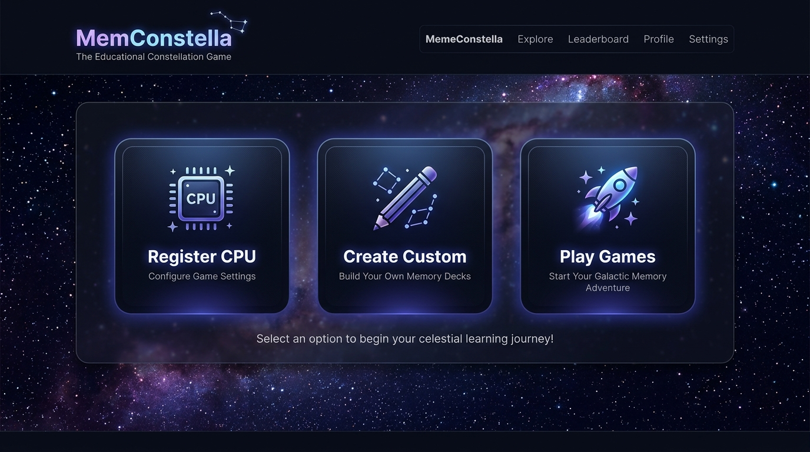
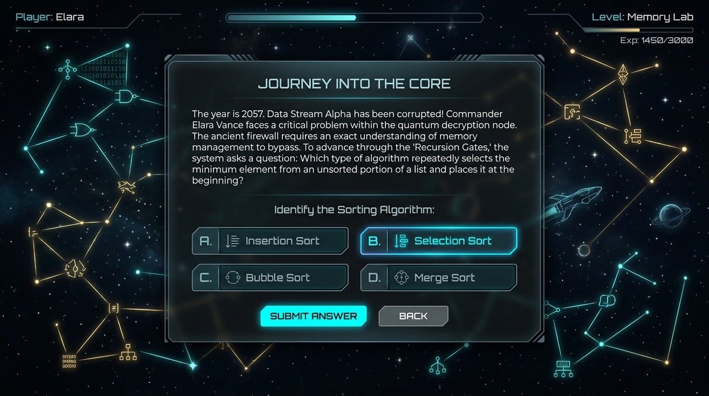
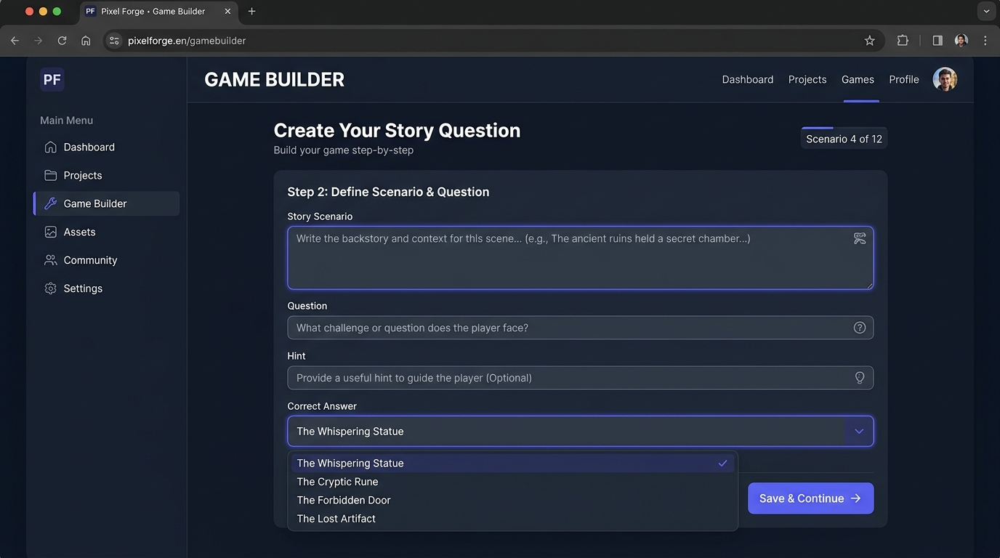
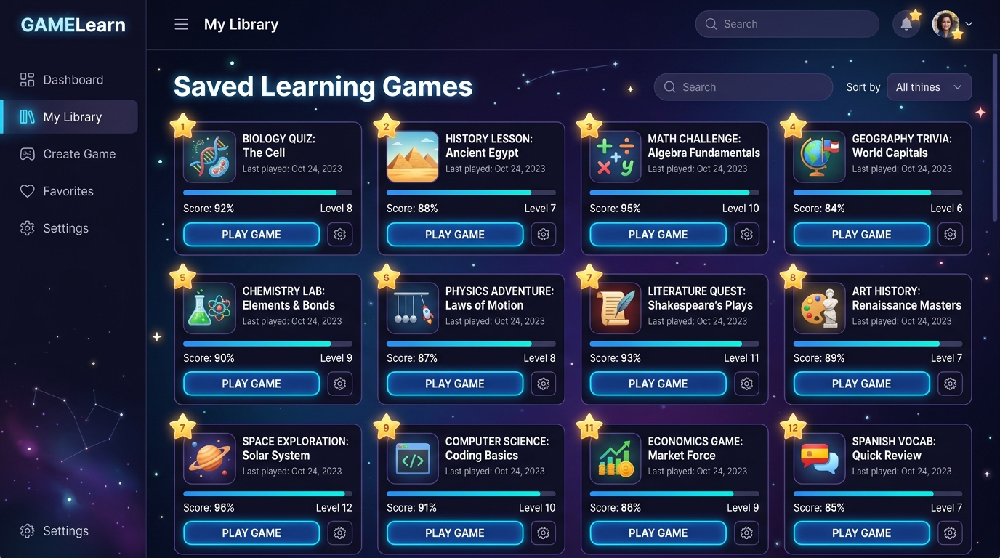
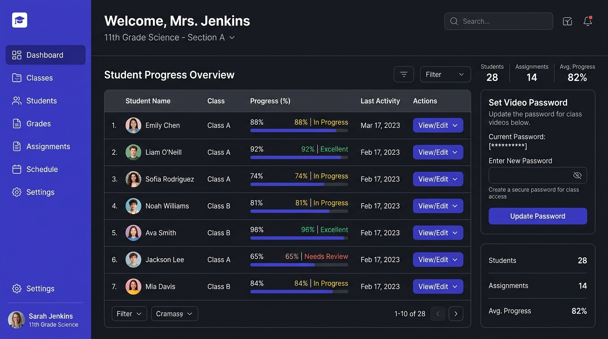
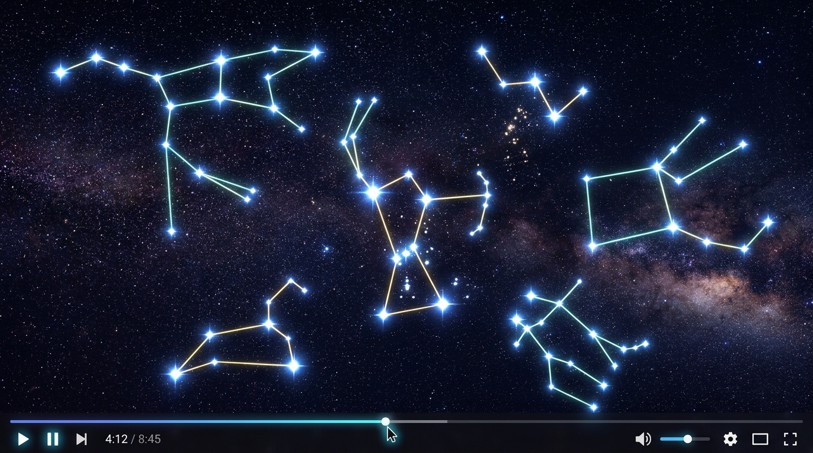
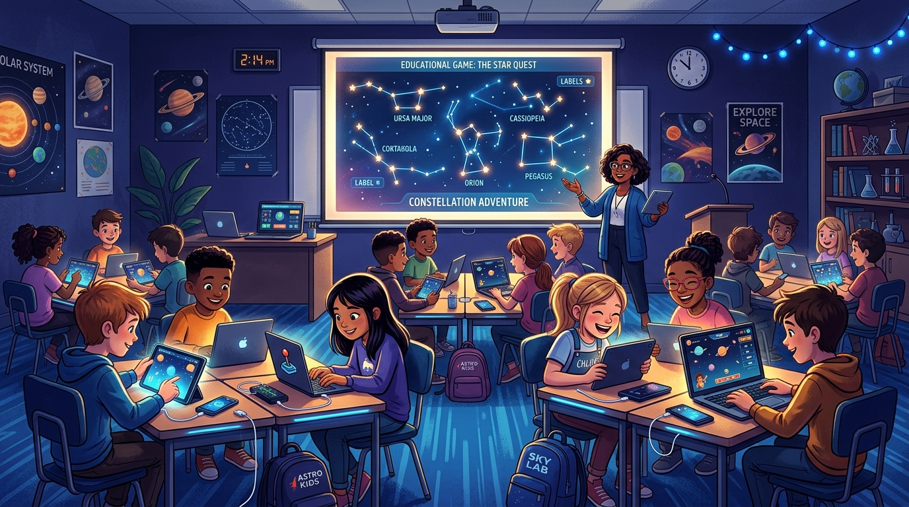

*Read this in other languages: [English](README.md), [Bahasa Indonesia](README-id.md).*

# MemConstella 🌌

Game edukasi berbasis web di mana siswa memetakan topik teknis atau konseptual ke dalam rasi bintang interaktif. Awalnya didesain untuk mengajarkan Register CPU (PC, IR, MAR, MDR, ACC), aplikasi ini sekarang menjadi platform yang sepenuhnya dapat dikustomisasi! Pendidik dapat menggunakan materi Register CPU bawaan atau menggunakan **Game Builder** untuk membuat dan menyimpan paket pembelajaran mereka sendiri untuk mata pelajaran apa pun.



## ✨ Fitur Utama

*   **3 Mode Bermain di Halaman Awal:**
    *   **Register CPU:** Memulai permainan dengan materi arsitektur IT bawaan.
    *   **Create Custom:** Menggunakan Game Builder bawaan untuk membuat paket pembelajaran baru dari awal.
    *   **Play Games:** Mengakses dan memainkan paket game kustom yang sudah Anda simpan sebelumnya dari Library.
*   **Game Builder Kustom Bawaan:** 
    *   Buat materi kustom dengan mudah menggunakan UI yang selangkah demi selangkah. 
    *   Tentukan "item hafalan" Anda sendiri (misalnya, istilah Biologi, tokoh Sejarah, kosakata Bahasa).
    *   Konfigurasi ruangan/pertanyaan secara manual menggunakan form, atau unggah file JSON untuk ruangan tertentu.
    *   Simpan paket secara lokal di browser untuk akses cepat di sesi mendatang.
*   **Mode Observasi Video:** 
    *   Animasi rasi bintang SVG interaktif memainkan urutan langkah secara visual dan berulang (loop) dengan mulus!
    *   Terdapat fitur **Download Video** yang otomatis merekam dan menyimpan video ke perangkat dalam 1 menit.
    *   Guru dapat mengatur **Video Password** kustom di Teacher Dashboard untuk membatasi akses dengan aman.
    *   Siswa harus memasukkan password yang benar untuk membuka dan melihat animasi video.
*   **Dashboard Guru:** Pemantauan real-time untuk semua koneksi siswa, percobaan, dan status penyelesaian ruangan.

---

## 🚀 Memulai (Instalasi)

**Prasyarat:** Node.js (v16+).

1.  **Clone / Download Repository**
2.  **Instal dependensi:**
    ```bash
    npm install
    ```
3.  **Jalankan aplikasi secara lokal:**
    ```bash
    npm run dev
    ```
4.  Buka `http://localhost:3000` di browser Anda.

---

## 🎮 Cara Menggunakan Aplikasi (User Guide)

Aplikasi ini memiliki 3 mode utama. Berikut adalah panduan cara menggunakannya:

### 1. Bermain Mode Default (Register CPU)
Mode ini sudah memiliki soal bawaan mengenai arsitektur CPU dan Register.
* Di halaman utama, pilih **Register CPU**.
* Masukkan nama Anda dan masuk ke dalam permainan.
* Jawab setiap pertanyaan di setiap ruangan (Room) dengan memilih jawaban yang tepat berdasarkan cerita/petunjuk.



### 2. Membuat Materi Sendiri (Create Custom)
Anda bisa membuat soal kustom untuk pelajaran apa saja (Biologi, Sejarah, Bahasa, dll).
1. Pada halaman utama, klik **Create Custom**.
2. **Step 1:** Masukkan nama materi/paket pembelajaran Anda.
3. **Step 2:** Tambahkan semua daftar item/konsep utama yang perlu dihafal oleh siswa (contoh: Kloroplas, Mitokondria, dll).
4. **Step 3:** Konfigurasi 4 ruangan (Rooms). Untuk setiap ruangan:
   * Masukkan skenario cerita.
   * Masukkan teks pertanyaan dan petunjuk (hint).
   * Pilih target jawaban yang benar dari daftar konsep yang sudah Anda buat di Step 2.
   * *(Opsional)* Anda juga bisa mengunggah file JSON untuk mengisi data ruangan secara otomatis.
5. Klik **Save Package**.



### 3. Memainkan Materi Buatan Sendiri (Play Games)
Setelah Anda menyimpan materi di tahap sebelumnya, materi tersebut akan tersimpan di Library browser Anda.
* Pada halaman utama, klik **Play Games**.
* Pilih paket game yang sudah Anda buat dari daftar Library.
* Klik **Play** untuk mulai bermain menggunakan soal-soal Anda sendiri.



---

## 👨‍🏫 Teacher Dashboard & Video Mode

Aplikasi ini dilengkapi dengan fitur pemantauan untuk guru dan animasi rasi bintang untuk siswa.

**Bagi Guru:**
* Guru dapat mengakses **Teacher Dashboard** untuk memantau progress siswa yang sedang bermain secara real-time.
* Guru dapat mengatur **Video Password** yang nantinya harus dimasukkan oleh siswa jika mereka ingin melihat Video Constellation.



**Bagi Siswa:**
* Siswa dapat mengakses **Global Observation Mode** (Video Mode).
* Siswa akan diminta memasukkan password yang diberikan oleh guru.
* Setelah berhasil, siswa akan disuguhkan animasi pergerakan rasi bintang yang dimainkan secara otomatis (loop).



---

## 👩‍🏫 Cara Bermain di Kelas Bersama Siswa



Saat mengimplementasikan permainan ini di dalam kelas, ada **2 pilihan skenario** yang bisa Anda (Guru) gunakan untuk menayangkan animasi *Video Constellation* (Rasi Bintang) agar selaras dengan permainan siswa:

### Opsi 1: Video di Layar Terpisah (Proyektor / Layar Utama Kelas)
Opsi ini sangat ideal untuk permainan interaktif terpusat.
1. **Persiapan Guru:** Guru membuka game di komputer yang tersambung ke proyektor di depan kelas. Guru masuk ke **Global Observation Mode** (Video Mode), memasukkan password, dan memutar animasinya secara *fullscreen* di proyektor. (Guru juga dapat mendownload videonya terlebih dahulu menggunakan fitur *Download Video*).
2. **Aktivitas Siswa:** Siswa membuka aplikasi di perangkat mereka masing-masing (laptop/tablet/HP) dan langsung masuk ke permainan (tidak perlu masuk ke menu Video Mode).
3. **Cara Bermain:** Siswa berdiskusi atau secara individu menjawab soal-soal di layar perangkat mereka **dengan berpatokan pada animasi rasi bintang yang terus berputar di proyektor depan kelas**. 

### Opsi 2: Video di Layar yang Sama (Perangkat Individu Siswa)
Opsi ini cocok jika siswa belajar secara mandiri, jarak jauh (online), atau tidak tersedia fasilitas proyektor di kelas.
1. **Persiapan Guru:** Guru membagikan **Video Password** kepada seluruh siswa.
2. **Aktivitas Siswa:** Siswa membuka aplikasi di perangkat mereka masing-masing.
3. **Cara Bermain:** 
   * Siswa membuka menu **Global Observation Mode**, memasukkan password, dan melihat animasinya langsung di layar mereka.
   * Siswa dapat menekan tombol **Download Video** untuk menyimpan video tersebut. 
   * Setelah video tersimpan, siswa memutar video tersebut dan menyandingkannya (*split-screen*) dengan browser utama yang membuka halaman soal permainan. Siswa kini dapat menganalisa video di satu sisi layar sambil menjawab pertanyaan di sisi layar lainnya.

---

## 🛠️ Teknologi yang Digunakan

*   React 18
*   Vite
*   Tailwind CSS
*   Lucide React (Icons)
